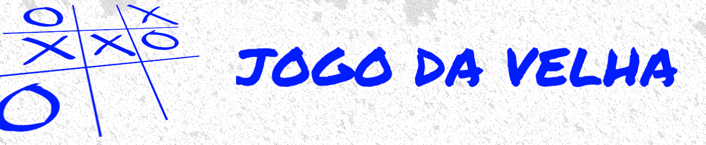

# Projeto: Criando seu próprio jogo da velha com HTML e Javascript

# Projeto

Construção de um jogo da velha, utilizando somente HTML para estruturar nosso site, CSS para estilizar e dar vida a ele, e Javascript para criarmos toda suas interações, desde a escolha do jogador, efetivar uma jogada e dar um vencedor ao jogo.

## Tecnologias

* HTMl5
* CSS3
* Javascript

## Instrutor(a)

Vitor Ruschoni
Engenheiro de software, PicPay

## Entidade

Digital Inovation one 

## Autor
Edson souza

[Linkedin](https://www.linkedin.com/in/edsonfrs/)
[GitHub](https://github.com/Edsonfrs)

